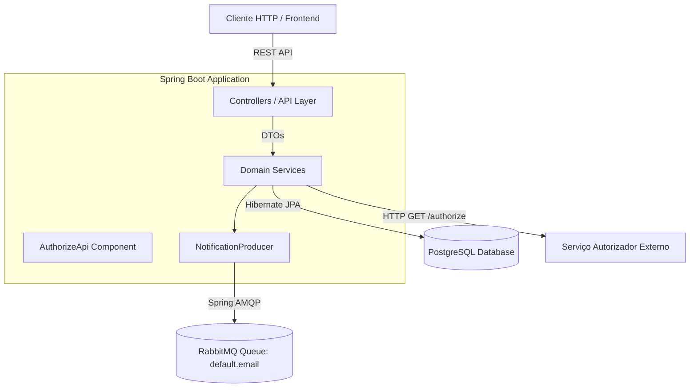
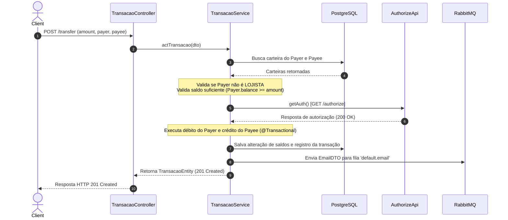

# Arquitetura do Sistema - PicPay Desafio Backend

## Visão Geral

A aplicação é uma API RESTful desenvolvida em **Java 21** e **Spring Boot 4.0.5**, projetada para intermediar transferências financeiras entre usuários comuns e lojistas com suporte a transações atômicas, integração com serviços externos de autorização e notificações assíncronas via mensageria.

---

## Diagrama de Arquitetura



---

## Estrutura de Camadas e Pacotes

A aplicação adota uma organização baseada em domínios (`bank.picpay`):

```text
src/main/java/bank/picpay/
├── Api/
│   ├── Controller/                # Controladores REST (/usuario, /lojista, /carteira, /transfer)
│   ├── Exceptions/                # Manipulação global de exceções (GlobalExceptionHandler)
│   └── auth/                      # Cliente de integração HTTP para autorizador externo
├── Config/                        # Configurações de Beans (RestTemplate, RabbitMQ, AMQP)
├── Dominio/
│   ├── Carteira/                  # Entidades, DTOs e Serviços da Carteira Digital
│   ├── Notify/                    # Produção e envio de mensagens de notificação
│   ├── Transacao/                 # Regras de negócio de transferências e saldos
│   ├── Usuario/                   # Gerenciamento de Usuários (PF) e Lojistas (PJ)
│   └── models/                    # DTOs de respostas externas
└── Infra/
    └── repository/                # Interfaces Spring Data JPA Repositories
```

---

## Fluxo da Transação Financeira (`/transfer`)



---

## Principais Componentes e Suas Responsabilidades

### 1. Camada de Domínio (`bank.picpay.Dominio`)
* **`UsuarioService`**: Validação e persistência de dados cadastrais de Usuários (CPF) e Lojistas (CNPJ).
* **`CarteiraService`**: Vinculação de carteiras a usuários cadastrados e inicialização de saldo zerado.
* **`TransacaoService`**: Orquestra a regra de negócio da transferência. Garante atomicidade via anotação `@Transactional` (rollback automático em caso de exceção).

### 2. Integração Externa (`bank.picpay.Api.auth.auth.AuthorizeApi`)
* Utiliza `RestTemplate` para consultar o serviço externo de autorização (`https://util.devi.tools/api/v2/authorize`).
* Lança `BusinessException` caso o serviço recuse a transação ou responda com erro HTTP.

### 3. Mensageria Assíncrona (`bank.picpay.Dominio.Notify.NotificationProducer`)
* Publica eventos de transferência concluída na fila do RabbitMQ (`broker.queue.email.name=default.email`).
* Assegura desacoplamento entre o processamento síncrono da transação e o envio de e-mails/notificações.
