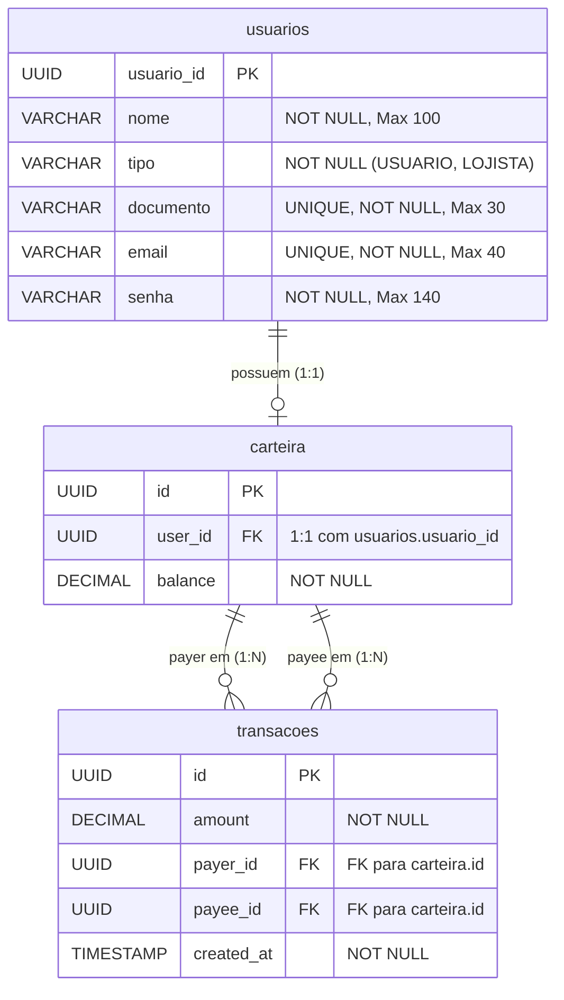

# Modelo de Banco de Dados - PicPay

## Visão Geral

O banco de dados utilizado em produção é o **PostgreSQL 16**. O mapeamento objeto-relacional é feito via Hibernate / JPA. O Flyway é utilizado para gerenciamento e baselining das migrações do banco (`V1__usuarios-table.sql`).

---

## Diagrama Entidade-Relacionamento (ERD)

---

## Detalhamento das Tabelas

### 1. Tabela `usuarios`

Armazena as informações cadastrais dos usuários do sistema (Pessoas Físicas e Lojistas).

| Coluna | Tipo de Dado | Restrições | Descrição |
|---|---|---|---|
| `usuario_id` | `UUID` | `PRIMARY KEY` | Identificador único gerado automaticamente |
| `nome` | `VARCHAR(100)` | `NOT NULL` | Nome completo do usuário ou razão social do lojista |
| `tipo` | `VARCHAR(20)` | `NOT NULL` | Tipo da conta (`USUARIO` ou `LOJISTA`) |
| `documento` | `VARCHAR(30)` | `NOT NULL, UNIQUE` | CPF (Pessoa Física) ou CNPJ (Pessoa Jurídica) |
| `email` | `VARCHAR(40)` | `NOT NULL, UNIQUE` | Endereço de e-mail |
| `senha` | `VARCHAR(140)` | `NOT NULL` | Senha de acesso |

---

### 2. Tabela `carteira`

Representa a carteira digital vinculada a um usuário cadastrado.

| Coluna | Tipo de Dado | Restrições | Descrição |
|---|---|---|---|
| `id` | `UUID` | `PRIMARY KEY` | Identificador único da carteira digital |
| `user_id` | `UUID` | `FOREIGN KEY` | Referência para `usuarios.usuario_id` (Chave Estrangeira 1:1) |
| `balance` | `NUMERIC/DECIMAL` | `NOT NULL` | Saldo disponível na carteira digital (inicia com 0.00) |

---

### 3. Tabela `transacoes`

Registra o histórico de transferências financeiras efetuadas entre carteiras.

| Coluna | Tipo de Dado | Restrições | Descrição |
|---|---|---|---|
| `id` | `UUID` | `PRIMARY KEY` | Identificador único da transação |
| `amount` | `NUMERIC/DECIMAL` | `NOT NULL` | Valor transferido |
| `payer_id` | `UUID` | `FOREIGN KEY` | Referência para `carteira.id` da carteira pagadora |
| `payee_id` | `UUID` | `FOREIGN KEY` | Referência para `carteira.id` da carteira recebedora |
| `created_at` | `TIMESTAMP` | `NOT NULL` | Data e hora em que a transação foi processada (Instant UTC) |

---

## Migrações Flyway

* **`V1__usuarios-table.sql`**: Script de inicialização da tabela `usuarios`.
* O Hibernate está configurado para atualizar/criar as tabelas complementares (`spring.jpa.hibernate.ddl-auto=update`).
